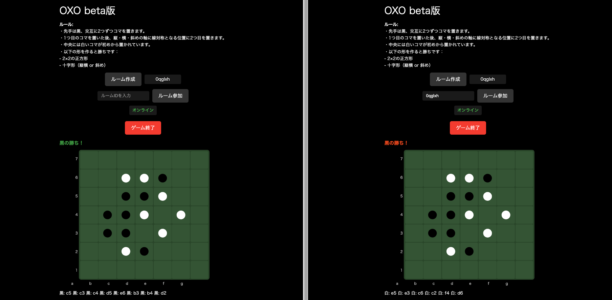

# oxo

上田悠 の 作品。アブストラクトゲーム。

https://bglab-oxo.web.app/




## 開発

技術:

- フレームワーク: Next.js (App Router / `output: "export"` で静的HTMLに書き出し) + React + TypeScript
- ゲームの実装: バニラ JavaScript（`hosting/public/*.js`）+ CSS
- Firebase Realtime Database (対戦機能) / Firebase Hosting
- Jest + Testing Library (テスト)
- GitHub Actions (PR プレビュー・main マージで自動デプロイ)

### 構成

Next.js/React はゲームを描画する薄いシェルで、対戦・盤面ロジックは `hosting/public/` の素の JavaScript が担います。
シェル（[GameBoard.tsx](hosting/app/components/GameBoard.tsx)）がこれらを `<script>` として動的に読み込みます。


### ローカル開発

依存をインストールします（Node は `.tool-versions` のバージョンを利用）。

```
cd hosting && npm install
```

ローカルでは本番DBを汚さないよう、`localhost` アクセス時は自動で Realtime Database emulator に接続します。対戦機能を試すには emulator とアプリの**両方**を起動してください（別々のターミナルで）。

```
# ターミナル1: emulator（127.0.0.1:9000 / UI は http://127.0.0.1:4000）
cd hosting && npm run emulators

# ターミナル2: アプリ（http://localhost:3000）
cd hosting && npm run dev
```

ブラウザのコンソールに `[OXO] Realtime Database emulator に接続しました (127.0.0.1:9000)` が出れば emulator に繋がっています。emulator を起動せずに `npm run dev` すると、対戦機能は接続先が無くエラーになります。

### デプロイ

main にマージすると Hosting が自動でデプロイされます。

Realtime Database のセキュリティルール（[database.rules.json](database.rules.json)）は自動デプロイに含まれないため、変更時は手動で反映してください。

```
npx firebase deploy --only database
```

## ルール

- 先手は黒、交互に2つずつコマを置きます。
- 1つ目のコマを置いた後、縦・横・斜めの軸に線対称となる位置に2つ目を置きます。
- 中央には白いコマが初めから置かれています。
- 以下の形を作ると勝ちです：
  - 2×2の正方形
  - 十字形（縦横 or 斜め）

## テスト

```
cd hosting && npm run test
```

## ライセンス

ソースコードは [MIT License](LICENSE) の下で公開しています。

なお、MIT ライセンスが適用されるのは**このリポジトリのソースコードのみ**です。ゲーム「oxo」のデザインおよびルールは 上田悠 氏の作品です（ゲームのルール・仕組み自体は著作権の保護対象外）。
